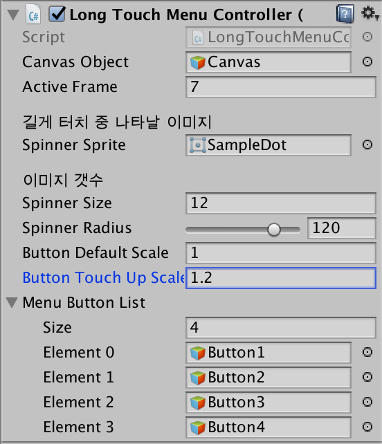

# Unity LongTouchMenu
[](https://youtu.be/zbFMG7zhOsE)  
*클릭해서 동영상 재생*

터치(클릭)을 길게 하면 버튼 리스트가 등장하는 유니티 패키지입니다.

# 사용법

1. `LongTouchMenu.unitypackage` 를 자신의 프로젝트에 Import합니다.
2. 상단 메뉴 `GameObject` - `Create Empty`를 눌러 빈 게임오브젝트를 생성합니다.
3. 그리고 해당 오브젝트에 `Long Touch Menu Controller`를 추가합니다.
4. 각 요소들을 다음 설명에 따라 설정합니다.  

    - `Canvas Object`: Scene의 Canvas를 연결합니다.
    - `Active Frame`: 동작 속도입니다. 얼마나 오래 터치를 하고있어야 메뉴가 나올 지 설정합니다.
    - `Spinner Sprite`: 로딩이 진행도를 표시하는 Sprite입니다.
        - 아무것도 연결하지 않을 경우 기본 이미지가 나타납니다.
    - `Spinner Radius`: 터치 위치에서부터 버튼이 표시될 반지름 거리입니다.
    - `Button Default Scale`: 연결된 버튼의 일반 상태의 스케일입니다.
    - `Button Touch Up Scale`: 연결된 버튼의 사용자의 손가락(마우스)가 위에 올라올 때의 스케일입니다.
    - `Menu Button List`: 터치를 길게 했을 때 나타날 버튼 리스트입니다. 추가하고 싶은 버튼을 Canvas에 생성한 다음, 이곳에 연결합니다.
5. 이후 각 버튼에 터치 콜백으로 동작하고 싶은 이벤트를 작성합니다.
```C#
using System.Collections;
using System.Collections.Generic;
using UnityEngine;
using UnityEngine.UI;

public class ButtonTouchControl : MonoBehaviour {
	// Use this for initialization
	void Start () {
		Button btn = gameObject.GetComponent<Button>();
		btn.onClick.AddListener(TaskOnClick);
	}
	
	// Update is called once per frame
	void Update () {
		
	}

	void TaskOnClick() {
		Debug.Log("You have clicked the " + gameObject.name);
	}
}
```
그리고 Scene을 실행시키고 터치를 길게 해보면 잘 동작하는 것을 확인할 수 있습니다.


# License
[](LICENSE)
